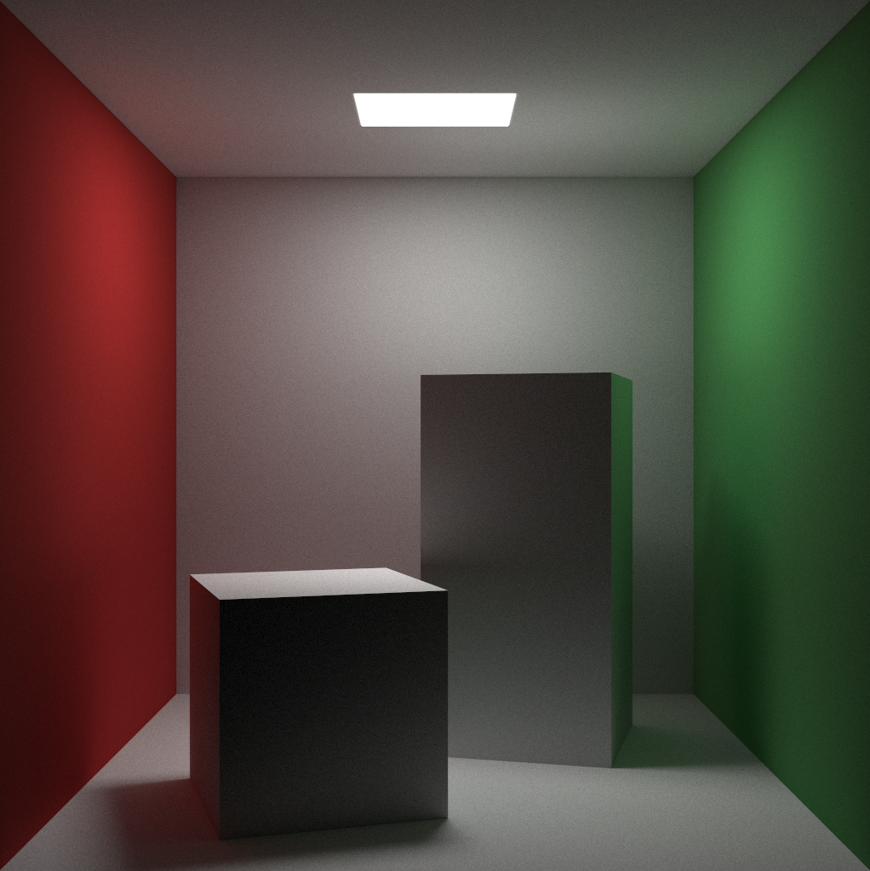
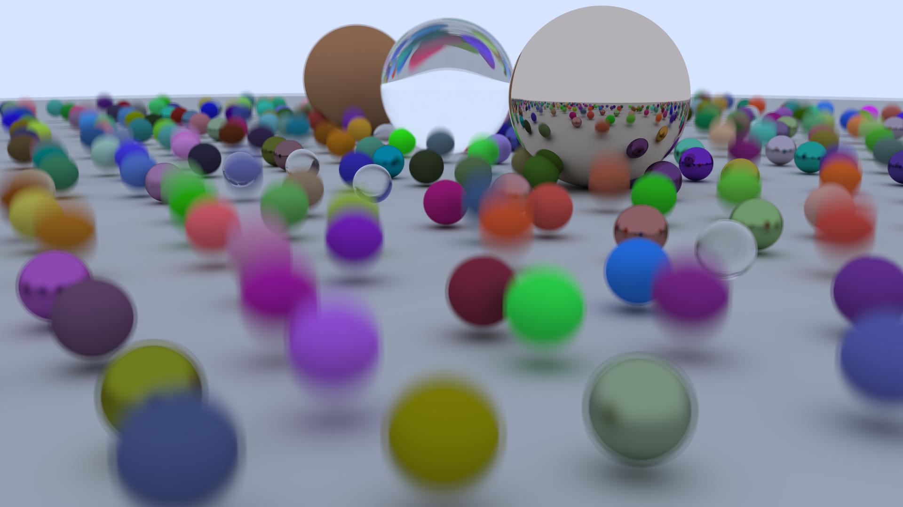
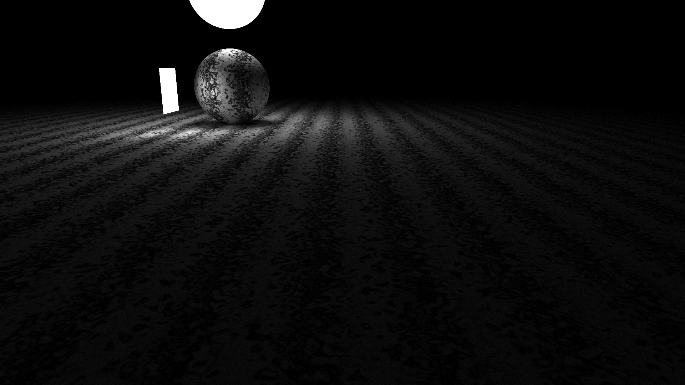
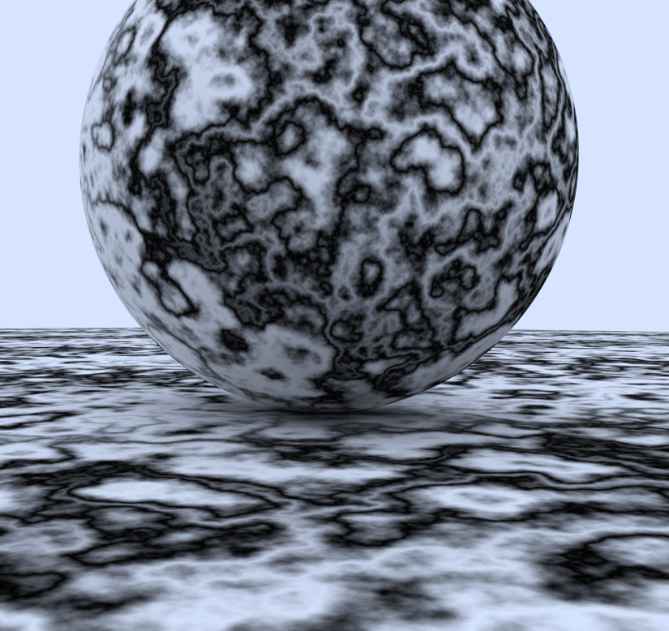
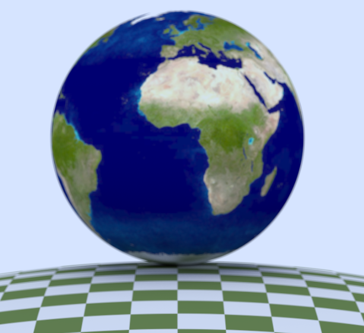

# Accellerated Ray Tracing
This raytracer is based on the Ray Tracing in One Weekend Book Series, and I adapated it to the Nvidia CUDA API for accelleration.
The program first asks the user for a scene, then it raytracer that scene on the GPU. Lastly, it outputs the final image to .../CUDA_Raytracer/CUDA_Raytracer/image.ppm.

## Features
* Path Tracing: The raytracer is actually a pathtracer. This results in more realistic lighting and reflectings compared to raytracing.
* BVH Structure: The raytracer makes use of a BVH structure to traverse the scene quicker. This greatly reduces render time in scenes with multiple objects. For example, in the scene "Random Spheres" with ~500 objects, it reduces the time to render by 99,29%.
* Multiple Materials: The raytracer supports lambertian, metal, dielectric (glass-like) and isotropic materials.
* Textures: It is possible to import an image to be used as a texture. Furthermore, there are also the perlin (marmer-like pattern) and checkered procedural textures. 
* Shapes: The raytracer can render triangles, quads and spheres.
* Lights: There are diffuse lights. Diffuse lights are essentially materials that emit light into the scene.
* Motion: The (still) scenes can immitate basic motion by assigning two positions to the object. The object will get blurry, as if it were moving between these positions at that frame.

## Running the project
You will need to have a version of the CUDA Toolkit installed. Then, you select the toolkit in the project settings. For Visual Studio 2022, you can do this by going to Project -> Properties -> CUDA C/C++ Common -> CUDA Toolkit Custom Dir.
At this setting, select the path to CUDA\*your installed version*.

Depending on your gpu, the scene fidelity and the Monto Carlo sample size, it may take anywhere from a few seconds to minutes to render the scene. It is possible to reduce render time (in tradeoff with fidelity) by going to the *selected scene*.cu file and
setting the AAMethod value of d_camera to a lower value.

## Credits
- https://raytracing.github.io/books/RayTracingInOneWeekend.html was used as a reference.
- https://developer.nvidia.com/blog/accelerated-ray-tracing-cuda was used as a reference for implementing the features of Ray Tracing in One Weekend in CUDA.
- https://github.com/xiahongze/RayTracingManyWeeksWithCuda was used for the BVH implementation.
